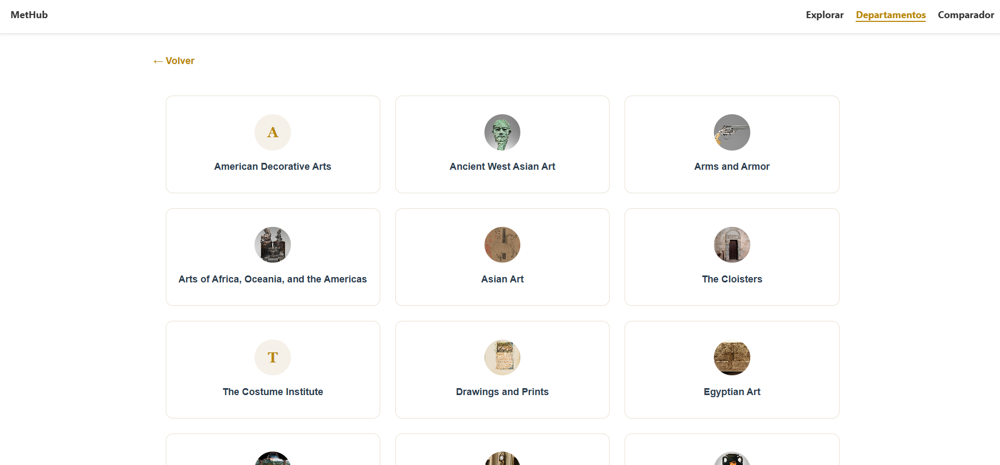
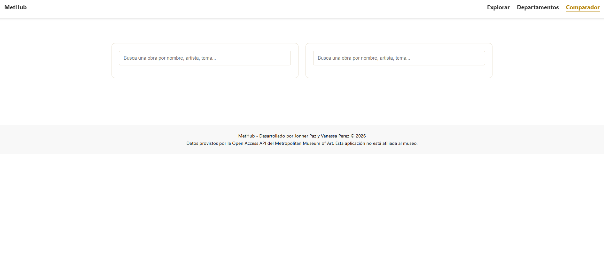
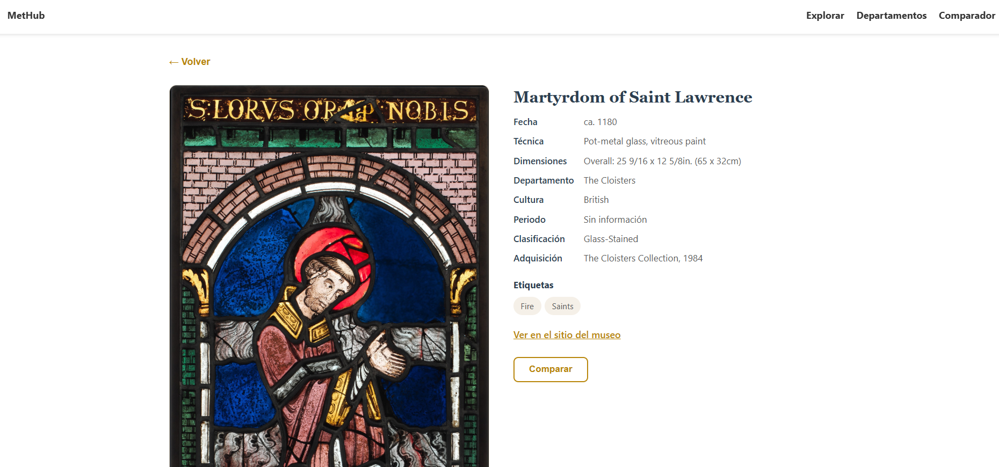
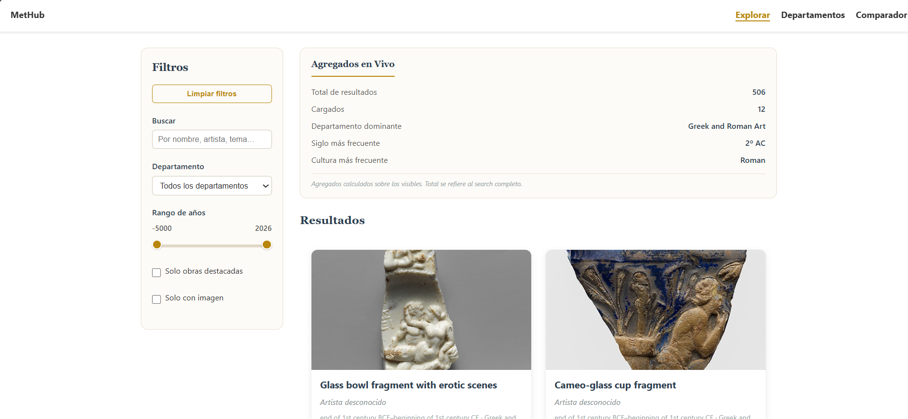
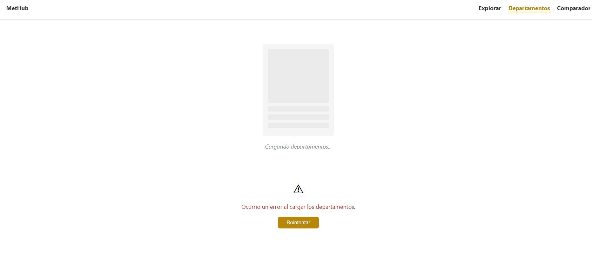

# MetHub: Explorador de la Colección del Met

## Descripción del Proyecto

MetHub es una aplicación web de página única (SPA) desarrollada como un cliente interactivo para la API pública del [Metropolitan Museum of Art](https://www.google.com/search?q=https://collectionapi.metmuseum.org/). El sistema permite explorar una colección de aproximadamente 470,000 obras de arte, ofreciendo herramientas avanzadas de filtrado, búsqueda y comparación, todo ello construido exclusivamente con tecnologías web estándar (HTML, CSS y JavaScript Vanilla).

## Estructura del Proyecto

    /met-hub
    ├── index.html          # Contenedor principal (SPA shell)
    ├── css/
    │   └── styles.css      # Estilos globales y específicos de vistas
    ├── js/
    │   ├── app.js          # Punto de entrada, router y lógica global
    │   ├── api.js          # Capa de servicio (fetch, peticiones, AbortController)
    │   ├── core            # Router.js
    │   ├── views           # Renderización dinámica de las seis vistas del  sistema
    │   └── components/     # Custom Elements (ej: Card.js, SearchBar.js)
    └── README.md           # Entregable requerido [cite: 197]

## Capturas de Pantalla

Vista de Inicio:

Vista de Departamentos:

Vista para Comparar:

Vista de Detalles de Obra:

Vista de Explorar o Busqueda:

Vista de Error/Estado de Carga:

## Instrucciones de Ejecución

1. Clona este repositorio en tu máquina local.
2. Abre el archivo `index.html` directamente en cualquier navegador moderno.
3. No se requiere configuración de servidor local ni dependencias adicionales (Node.js/NPM no son necesarios).

## Decisiones Técnicas Relevantes

Para asegurar una experiencia fluida y respetar los límites de la API del Met, se tomaron las siguientes decisiones:

- Caché en Memoria (Map): Implementamos un Map dentro del servicio de API (MetApiService) para almacenar las imágenes representativas de cada departamento. Esto evita peticiones redundantes cuando el usuario navega entre vistas, reduciendo significativamente el consumo de la API.

- Abortion Controller: Se integró la API AbortController en todas las llamadas fetch. Esto permite cancelar peticiones pendientes si el usuario cambia de vista rápidamente, evitando "fugas" de red y errores de estado innecesarios.

- Arquitectura de Servicio: Se centralizó toda la lógica de comunicación en una clase MetApiService, permitiendo que los componentes de la interfaz sean puramente declarativos y no tengan conocimiento de la complejidad de la API. 