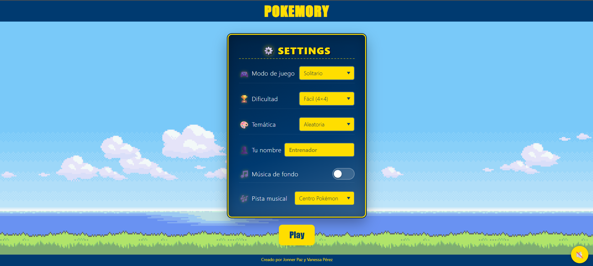
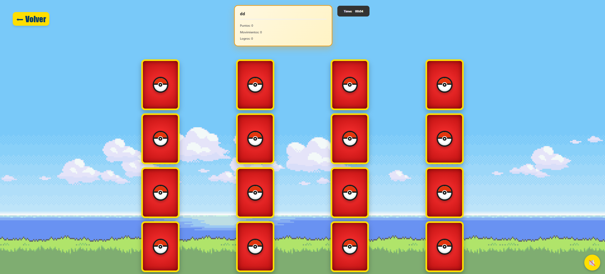
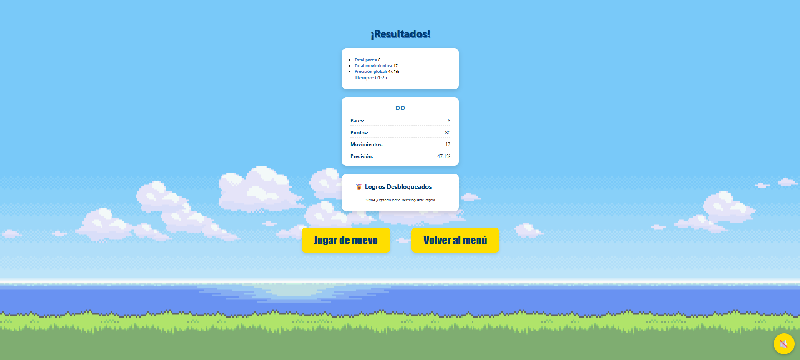

# 🎮 PokeMory: El Juego de Memoria Pokémon

## Descripción

¡Bienvenido a PokeMory! 🌟 Un juego de memoria web desafiante y nostálgico, diseñado para poner a prueba tu agilidad mental al estilo de los mejores entrenadores Pokémon. 🧠⚡

🚀 Descripción
PokeMory es una SPA (Single Page Application) construida con tecnologías web modernas, enfocada en la limpieza del código y la modularidad de componentes. ¡Entrena tu memoria encontrando parejas de tus criaturas favoritas! 🐾✨

## ✨ Características Principales
- Modos de juego versátiles: Solitario, PvP (Jugador vs Jugador) y Modo Libre. 🎮
- Dificultad ajustable: Elige tu reto (4×4, 6×6 u 8×8). 🏆
- Temáticas dinámicas: Filtra tus cartas por tipos de Pokémon. 🎨
- Experiencia inmersiva: Música de fondo seleccionable y efectos sonoros. 🎵
- Progreso detallado: Seguimiento de puntajes, movimientos realizados y tiempo. ⏱️
- Sistema de Logros: ¡Desbloquea medallas al completar retos especiales! 🏅
- Interfaz elegante: Pantalla de resultados finales con estadísticas detalladas. 📊

## Estructura del proyecto

```text
proyectos/memoria/
├── index.html
├── README.md
├── requirements.md
├── assets/
│   ├── audio/
│   └── images/
├── js/
│   ├── app.js
│   ├── api/
│   │   └── pokeapi.js
│   ├── components/
│   │   ├── board.js
│   │   ├── createCard.js
│   │   ├── hudMenu.js
│   │   ├── musicToggle.js
│   │   ├── playerBadge.js
│   │   ├── renderSettings.js
│   │   ├── timer.js
│   │   └── toast.js
│   ├── core/
│   │   ├── awards.js
│   │   ├── gameEngine.js
│   │   ├── musicService.js
│   │   ├── Router.js
│   │   └── timer.js
│   ├── state/
│   │   ├── GameState.js
│   │   ├── playerFactory.js
│   │   ├── Pokemon.js
│   │   └── User.js
│   ├── utils/
│   │   └── resultsBuilder.js
│   └── views/
│       ├── GameView.js
│       ├── HomeView.js
│       └── ResultsView.js
└── styles/
    ├── Card.css
    ├── GameBoard.css
    ├── GameView.css
    ├── HomeView.css
    ├── ResultsView.css
    ├── Settings.css
    ├── style.css
    ├── timer.css
    ├── toast.css
    └── hudMenu.css
```

## Carpeta `js/`

- `app.js`: punto de entrada que inicializa el `Router`, carga las vistas y añade
  el control de música.
- `api/pokeapi.js`: cliente para consumir la PokeAPI y obtener datos de Pokémon.
- `components/`: UI reutilizable y lógica de renderizado.
  - `board.js`: genera el tablero de cartas y solicita los Pokémon.
  - `createCard.js`: crea las cartas con flip y estado de coincidencia.
  - `hudMenu.js`: muestra jugadores, cronómetro y controles de finalización.
  - `musicToggle.js`: botón flotante para reproducir/pausar la música.
  - `playerBadge.js`: representación de cada jugador en el HUD.
  - `renderSettings.js`: formulario de configuración de modo, dificultad,
    temática y audio.
  - `timer.js`: componente de temporizador del juego.
  - `toast.js`: notificaciones de logros y mensajes emergentes.
- `core/`: lógica del juego independiente del DOM.
  - `Router.js`: manejador de rutas hash para navegación SPA.
  - `gameEngine.js`: reglas de emparejamiento, turnos, puntos y fin de juego.
  - `awards.js`: lógica de desbloqueo de logros.
  - `musicService.js`: administración de música de fondo.
  - `timer.js`: controlador del cronómetro del juego.
- `state/`: almacenamiento y construcción de datos de juego.
  - `GameState.js`: singleton que mantiene el estado global.
  - `playerFactory.js`: crea los jugadores activos según el modo.
  - `Pokemon.js`: DTO/entidad de los datos del Pokémon.
  - `User.js`: modelo de jugador.
- `views/`: vistas principales montadas por el router.
  - `HomeView.js`: pantalla inicial y acceso a la configuración.
  - `GameView.js`: vista principal del juego con tablero y HUD.
  - `ResultsView.js`: pantalla final con estadísticas y logros.

## 🛠️ Tecnologías Utilizadas

- HTML5 & CSS3 🌐
- Vanilla JavaScript (ES Modules) 🚀
- PokeAPI 🍎 (Fuente de datos de Pokémon)

## 🚀 Cómo Empezar
1. Clona o descarga este repositorio.
2. Ejecuta el proyecto:
  - Puedes simplemente abrir index.html en tu navegador. 🌐
  - Recomendación: Usa un servidor local (como Live Server en VS Code o npx http-server) para evitar problemas con los módulos ES.
3. ¡Prepárate para ser el mejor entrenador de memoria! 🧢✨

## 👥 Autores
- Jonner Paz 👤
- Vanessa Pérez 👤

## Capturas de Pantalla

### Inicio


### Jugando (Modo fácil)


### Resultados

